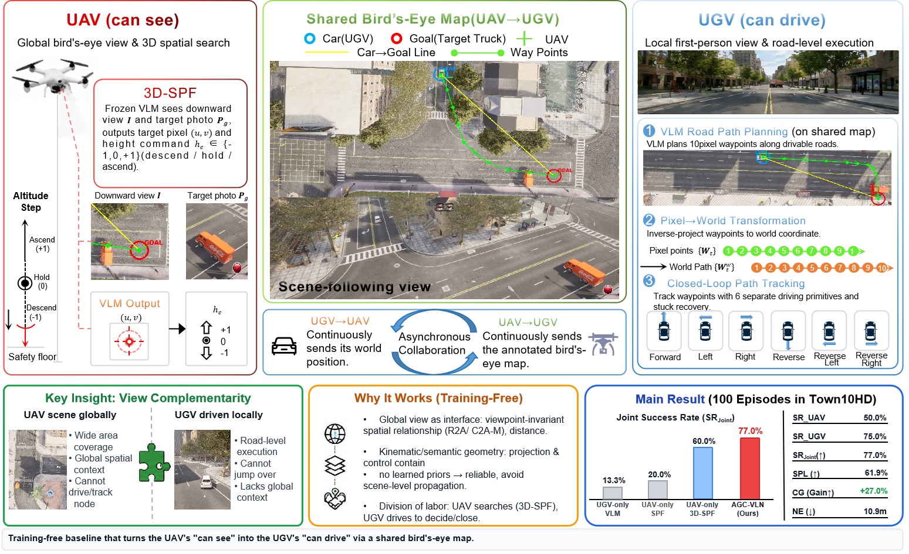
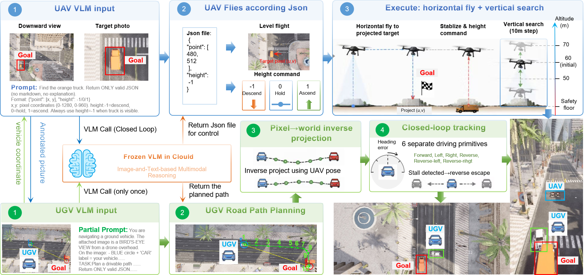
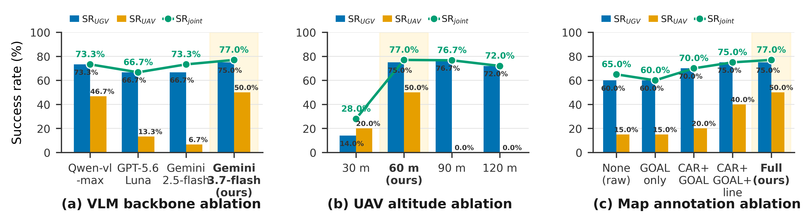
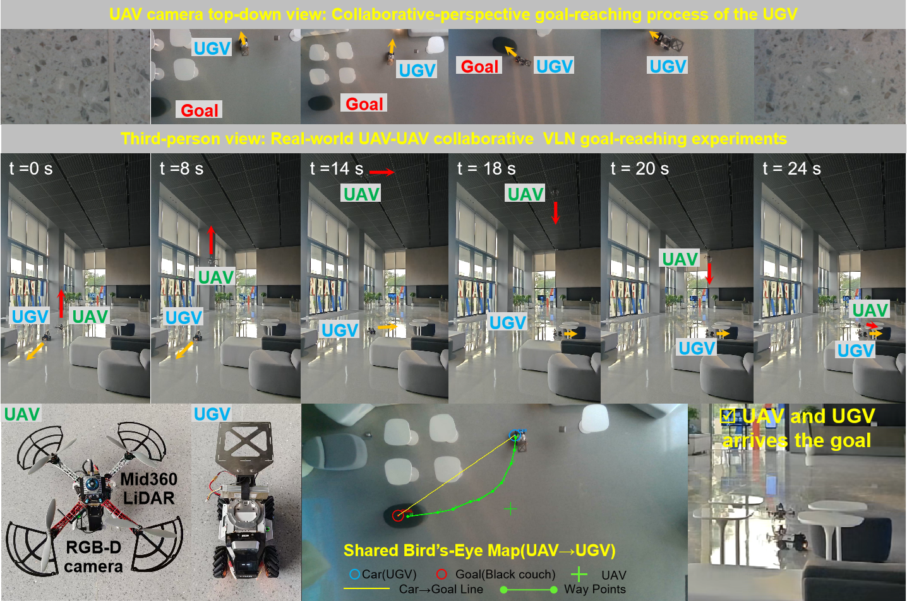

<div align="center">

# AGC-VLN

### Air-Ground Collaborative Vision-and-Language Navigation via Shared Bird's-Eye Maps

**Training-free air-ground collaboration — the UAV turns its "can see" into the UGV's "can drive".**

[](https://arxiv.org/abs/XXXX.XXXXX)
[](LICENSE)
[](https://www.python.org/)

</div>

<p align="center">
  
</p>

## Overview

Air-ground collaborative **Vision-and-Language Navigation (VLN)** pairs an
unmanned aerial vehicle (UAV) with a global bird's-eye view and an unmanned
ground vehicle (UGV) with a local first-person view. Existing training-free
methods solve single-agent tasks but offer no collaboration mechanism, and
trained VLA models fail to turn single-agent skill into cooperative behavior.

**AGC-VLN** is the first *training-free* baseline for air-ground collaborative
VLN. The key insight is that training-free methods decompose navigation into
VLM-based *semantic reasoning* and deterministic *geometric execution*,
exposing a natural collaboration interface: a **shared bird's-eye map**.

- The **UAV** renders the UGV's reported pose and the VLM-anchored target as
  `CAR` / `GOAL` markers with distance labels onto its global bird's-eye view.
- The **UGV** reads this map, plans a road-following path with a frozen VLM,
  and executes it under closed-loop control.
- In parallel, the UAV runs **3D-SPF**, a spatial-search upgrade of
  See-Point-Fly (SPF) that localizes the target in the downward view and flies
  toward it.

No training, no learned cross-agent representation — just a frozen VLM
(`gemini-3.7-flash`) and deterministic geometry.

## Highlights

- 🚁 **3D-SPF** — adds a discrete height command (descend / hold / ascend) to
  SPF, turning fixed-altitude planar point-fly into three-dimensional spatial
  search (UAV success 20.0% → 60.0%, a 3× gain).
- 🗺️ **Shared bird's-eye map** — the UAV's global view fills the UGV's
  first-person blind spot, lifting the UGV from 13.3% → 75.0%.
- 🤝 **Positive collaboration gain** — joint success **77.0%**, a **+27.0%**
  gain over the weaker single agent, and **23.7 pts** above the best published
  single-agent baseline (Travel UAV, 53.3%).
- 🧊 **Training-free** — no gradients ever flow; a frozen VLM is orchestrated
  by deterministic geometry.
- 🤖 **Real-robot verified** — the same pipeline runs on a physical quadrotor
  and omnidirectional robot.

## Method

<p align="center">
  
</p>

### UAV — global perception & map rendering (3D-SPF)

The UAV faces a downward RGB camera and, at each decision step (≈3 s, ~0.33 Hz):

1. **Anchors** the target in the downward image with a frozen VLM against the
   target photo `P_g`.
2. **Renders** a shared bird's-eye map: a blue `CAR` marker (the UGV pose), a
   red `GOAL` marker (the target), a green cross (the UAV itself), a yellow
   `CAR→GOAL` reference line, and distance labels.
3. **Runs 3D-SPF** for itself: the VLM returns the target's pixel position and
   a discrete height command `h ∈ {descend, hold, ascend}`. The pixel is
   projected to world coordinates via flat-ground ray casting, the UAV flies
   toward it with proportional velocity, then adjusts altitude accordingly.

### UGV — map path planning & closed-loop execution

The UGV carries a forward camera and, upon receiving the annotated map:

1. **Plans** a 10-waypoint road path with a frozen VLM (first point = its own
   position, last point = the target, intermediate points follow the road).
2. **Projects** the pixel waypoints back to world coordinates using the UAV's
   pose at annotation time.
3. **Tracks** the path point-by-point with a closed-loop controller that
   discretizes the heading error into six driving primitives (forward / left /
   right / reverse / reverse-left / reverse-right), with stuck recovery.

### Collaboration — view complementarity

The two agents exchange only two things through shared memory: the UGV reports
its pose, and the UAV shares the annotated bird's-eye map. The UAV sees globally
but cannot drive; the UGV can drive but sees only locally. The shared map
delivers the UAV's global spatial context to the UGV in an image form its VLM
can consume directly — filling the UGV's blind spot.

## Results

On 100 closed-loop episodes in CARLA-Air's Town10HD scene, AGC-VLN reaches a
**77.0% joint success rate** — a **+27.0% collaboration gain** over the weaker
individual agent — and exceeds the strongest published single-agent baseline
(Travel UAV, 53.3%) by **23.7 points**.

<p align="center">
  
</p>

We ablate three design axes:

- **VLM backbone** — `gemini-3.7-flash` attains the highest joint success rate.
- **UAV initial altitude** — 60 m is optimal; too low narrows the field of view,
  too high shrinks the target to a handful of pixels.
- **Map annotation richness** — full annotation (CAR+GOAL+distance+line) is
  necessary; degrading it stepwise reduces the UGV's road-planning ability.

## Real-robot deployment

Beyond simulation, the same training-free pipeline runs on real hardware — a
quadrotor (Mid360 LiDAR + RealSense D435i) and an omnidirectional mobile
robot, both on Linux — confirming feasibility decoupled from the simulator's
synchronized pose stream.

<p align="center">
  
</p>

## Repository structure

```
AGC-VLN/
├── collab_UAV_UGV/        # main pipeline: UAV 3D-SPF + UGV VLM path planning
├── collab_UAV_UGV_alt/    # UAV initial-altitude ablation (30/60/90/120 m)
├── collab_UAV_UGV_annot/  # map-annotation-richness ablation
├── episodes/              # Town10HD episodes (50 spawn points) + goal photos
├── assets/                # figures used in this README
├── config.json.example    # VLM configuration template (copy to config.json)
├── requirements.txt       # Python dependencies
├── third_party/           # airsim-python client (bundled)
├── AirSimConfig/          # AirSim settings
└── env_setup/             # CARLA-Air environment setup
```

## Installation

```bash
# 1. Python dependencies
pip install -r requirements.txt

# 2. CARLA + AirSim environment (see env_setup/)
bash env_setup/setup_env.sh

# 3. VLM API key — copy the template and fill in your key
cp config.json.example config.json
export SPF_CCODE_API_KEY=...    # or set api_keys.ccode in config.json
```

`config.json` selects the VLM (`models.spf.model`, `base_urls`, `api_keys`).
The default model is `gemini-3.7-flash-c` over the `ccode` route.

## Usage

Run the main pipeline on one episode:

```bash
python collab_UAV_UGV/scripts/run_collab.py --episode-id town10hd_001 --auto
```

The UAV and UGV run as two parallel threads communicating through shared
memory. Each decision step (≈3 s) the UAV annotates the bird's-eye map and runs
3D-SPF, while the UGV plans a 10-waypoint road path and follows it with a
closed-loop controller. Success means either agent reaches the target within
10 m inside the time budget.

## Citation

If you use this code, please cite:

```bibtex
@article{zhang2026agcvln,
  title   = {Air-Ground Collaborative Vision-and-Language Navigation via Shared Bird's-Eye Maps},
  author  = {Shuning Zhang and Liang Li and Yunheng Wang and Tao Wang and Yihang Kang and Renjing Xu},
  year    = {2026},
}
```

## License

This project is released under the [MIT License](LICENSE).
